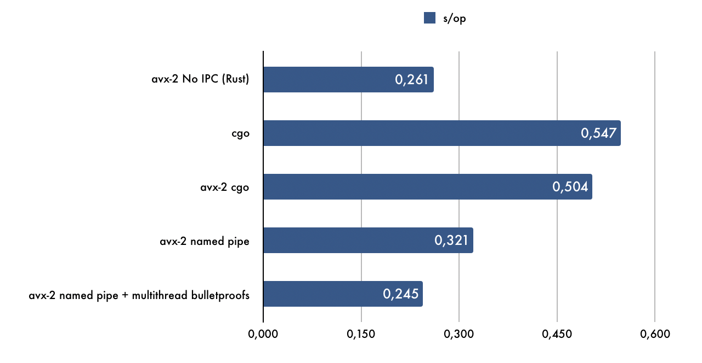

# Dusk Blind Bid Proof

This tool Implements the [Blind Bid Protocol](docs/blind-bid-protocol.pdf), and includes a zkproof prover and verifier that can be used in a separate process from any other languages and platform that support *nix named pipes.

The named pipes are used for better performance in interprocess comunication.

It uses a [custom, multithreaded version](https://gitlab.dusk.network/dusk-core/bulletproofs/tree/thread) of [dalek's bulletproofs](https://github.com/dalek-cryptography/bulletproofs/) in order to make the "fastest Bulletproofs implementation" even faster:

(*On Intel® Core™ i7-8559U Processor, lower is better*)

## How to build

    # avx-2 requires RUSTFLAGS="-C target_feature=+avx2"
    $ cargo build --release

## How to run 

The zkproof prover and verifier process can run as follow:

    $ cargo run --release

Or simply run the static executable once build.

## How to test the IPC

The IPC can be tested via Go as follow:

    $ cd go
    $ go test -timeout 300s gitlab.dusk.network/dusk-core/blindbidproof/go -run "^(TestProveVerify)\$" -count 1

As as the benchmark:

    $  cd go
    $  go test -benchmem -run=^\$ gitlab.dusk.network/dusk-core/blindbidproof/go -bench "^(BenchmarkProveVerify)\$" -v
